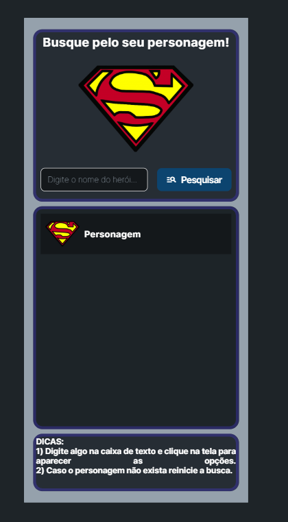
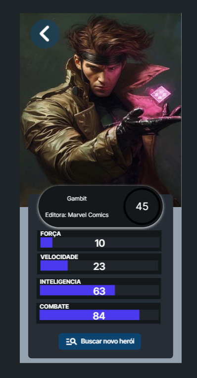

# Jogo de Cartas de Heróis (FlutterFlow)

## 📖 Descrição do Projeto

Este é um aplicativo de jogo de cartas de heróis desenvolvido como parte do Curso Técnico em Análise e Desenvolvimento de Sistemas da UEPB, em parceria com a FapesQ-PB. O objetivo do projeto é demonstrar o processo de criação de um aplicativo móvel interativo que consome dados de uma API pública para exibir informações sobre personagens de histórias em quadrinhos.

O aplicativo foi construído utilizando a plataforma de desenvolvimento low-code **FlutterFlow**, que permite a criação rápida de interfaces, e integrado com a **Super Hero API** para obter dados em tempo real sobre os heróis.

### 👨‍💻 Equipe e Orientação
* **Equipe:** Marcos Oliveira.
* **Professor Orientador:** Rodrigo Cesar Fonseca da Silva.

## ✨ Funcionalidades Principais

* **Busca de Heróis:** Permite ao usuário buscar por um personagem específico digitando seu nome.
* **Visualização de Detalhes:** Exibe uma tela detalhada com a imagem, nome e editora do personagem selecionado.
* **Atributos Dinâmicos:** Apresenta os atributos do herói (força, velocidade, inteligência e combate) de forma visual, utilizando barras de progresso que são preenchidas dinamicamente.
* **Cálculo de Média:** Calcula e exibe a média geral dos atributos do personagem em destaque.

## 🛠️ Tecnologias e Ferramentas

* **[FlutterFlow](https://docs.flutterflow.io/):** Plataforma low-code baseada em Flutter, utilizada para construir a interface visual e a lógica do aplicativo.
* **[Super Hero API](https://www.superheroapi.com/):** API pública que fornece dados detalhados sobre super-heróis e vilões, como estatísticas de poder, biografia e imagens.
* **Dart/Flutter:** Linguagem de programação e framework que servem como base para o FlutterFlow.
* **GitHub / GitHub Desktop:** Utilizados para controle de versão, documentação e gerenciamento do código-fonte do projeto.

## 🖼️ Telas da Aplicação

| Tela de Boas-Vindas | Tela de Busca | Tela de Detalhes |
| :---: | :---: | :---: |
|  |  |  |

## ⚙️ Como Funciona: Análise do Código

O fluxo de dados do aplicativo é simples e eficiente, conectando a interface do usuário à API externa.

1.  **Navegação Inicial:** A `boas_vindas_widget.dart` serve como tela de entrada e direciona o usuário para a `pesquisa_widget.dart`.
2.  **Entrada do Usuário:** Na tela de pesquisa, o usuário digita o nome do herói. O `TextFormField` captura essa entrada. Ao clicar em "Pesquisar", o aplicativo navega para a tela de detalhes, passando o nome do herói como um parâmetro de rota.
3.  **Chamada à API:** Assim que a `detalhes_widget.dart` é carregada, ela utiliza o nome do herói recebido para executar uma chamada à Super Hero API através do método `ApiHeroCall.call`.
4.  **Processamento e Exibição:**
    * A resposta da API (em formato JSON) é recebida.
    * A função customizada `newCustomFunction2` é usada para calcular a média dos atributos, tratando de forma segura os valores que possam ser "nulos" na resposta da API.
    * A interface é preenchida dinamicamente com os dados recebidos: a imagem é carregada com `Image.network`, e os `Text` e `LinearPercentIndicator` são populados com os nomes e valores dos atributos.

## 📁 Estrutura do Projeto

O código-fonte está organizado da seguinte maneira para manter a clareza e a manutenibilidade:

```
Com certeza! Uma ótima observação. A documentação deve sempre refletir a estrutura real do projeto.

Abaixo está a seção "Estrutura do Projeto" do seu README.md já corrigida para incluir a nova pasta. Você pode simplesmente substituir a seção antiga por esta.

Seção Corrigida para o README.md
Markdown

## 📁 Estrutura do Projeto

O código-fonte está organizado da seguinte maneira para manter a clareza e a manutenibilidade:

📁 JogoDeCartasHerois/
├── assets/
│   ├── images/          # Contém os ícones e imagens que o APP usa
│   └── docs_images/     # Contém as imagens usadas na DOCUMENTAÇÃO
├── lib/
│   ├── backend/         # Lógica de conexão com serviços externos
│   ├── custom_functions/  # Funções Dart personalizadas
│   ├── pages/           # Contém os arquivos de cada tela do app
│   └── flutter_flow/    # Arquivos de tema e utilitários gerados
├── .gitignore           # Ignora arquivos desnecessários no Git
├── pubspec.yaml         # Define as dependências e configurações
└── README.md            # Esta documentação
```

## 🚀 Como Executar o Projeto

Para executar este projeto, você precisa ter o ambiente de desenvolvimento Flutter configurado.

1.  **Clone o repositório:**
    ```bash
    git clone [https://github.com/MarcosOliveira16/Jogo-De-Cartas-Herois.git](https://github.com/MarcosOliveira16/Jogo-De-Cartas-Herois.git)
    ```
2.  **Navegue até a pasta do projeto:**
    ```bash
    cd Jogo-De-Cartas-Herois
    ```
3.  **Instale as dependências:**
    ```bash
    flutter pub get
    ```
4.  **Execute o aplicativo:**
    ```bash
    flutter run
    ```
    *Observação: Lembre-se de inserir seu próprio token de acesso no arquivo `lib/backend/api_requests/api_calls.dart` para que a chamada à Super Hero API funcione.*

## 📚 Referências

* FLUTTERFLOW. Documentação oficial. Disponível em: https://docs.flutterflow.io/. [cite_start]Acesso em: 22 maio 2025. [cite: 606]
* SUPERHERO API. Documentação oficial. Disponível em: https://www.superheroapi.com/. [cite_start]Acesso em: 22 maio 2025. [cite: 607]
* MATERIAL DIDÁTICO fornecido pelo professor da Universidade Estadual da Paraíba (UEPB), na plataforma Google Classroom, referente à disciplina de Programação para Dispositivos Móveis.
